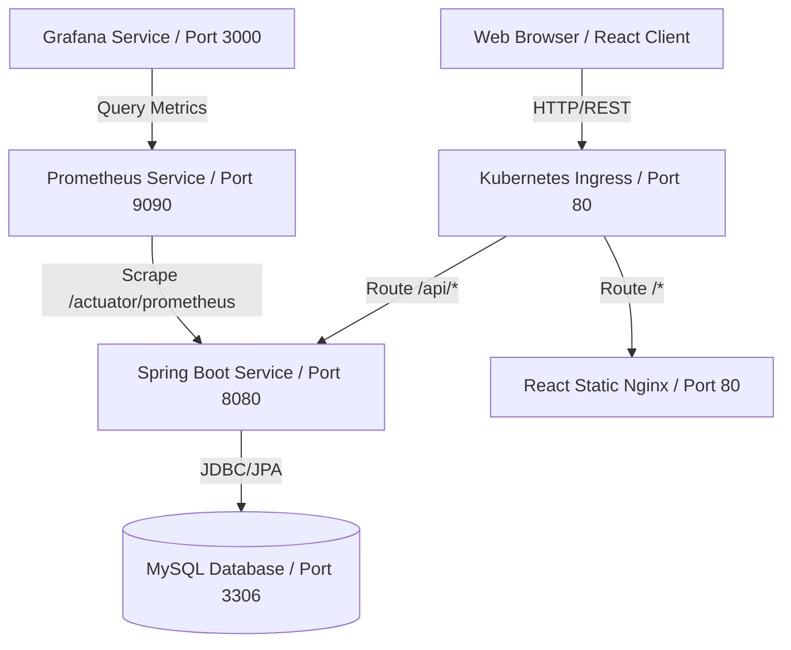

# Library OS: Production-Ready Library Management System

A modern, DevOps-engineered, and containerized Library Management System built with a Spring Boot Java REST backend, MySQL database, and a React + TailwindCSS dashboard frontend. It features JWT authentication, Role-Based Access Control (RBAC), Infrastructure-as-Code (IaC) deployment with Terraform, Kubernetes manifests, and a metrics monitoring stack using Prometheus and Grafana.

---

## 1. System Architecture



---

## 2. Project Folder Structure

The project has been laid out as a modular monorepo:

```text
library/
├── .github/
│   └── workflows/
│       ├── ci.yml                 # CI (Build, Maven tests, API tests, Docker check)
│       └── cd.yml                 # CD (Auto-deployment to K8s Dev/Prod)
├── api-tests/
│   └── test_api.sh                # Integration test runner script (curl/jq)
├── backend/
│   ├── src/                       # Spring Boot source code (Security, Controller, Service)
│   ├── pom.xml                    # Maven build dependency tree
│   └── Dockerfile                 # Multi-stage Java compile & JRE runtime image
├── database/
│   └── init.sql                   # MySQL schema definition & seed data
├── docker-compose.yml             # Local multi-container development orchestrator
├── frontend/
│   ├── src/                       # React frontend source (Dashboard, Books, Loans, Members)
│   ├── package.json               # NPM package manifest
│   ├── nginx.conf                 # SPA fallback proxy configuration
│   └── Dockerfile                 # Multi-stage NodeJS asset builder & Nginx host image
├── grafana/
│   ├── dashboards/
│   │   └── lms-dashboard.json     # Pre-configured Grafana telemetry panels
│   └── provisioning/              # Autoloaders for datasources & dashboards
├── kubernetes/
│   ├── namespace.yaml             # Isolated segment workspace namespace
│   ├── secrets.yaml               # Encrypted base64 environment values
│   ├── configmap.yaml             # Non-sensitive endpoints/hosts configuration
│   ├── mysql.yaml                 # Persistent MySQL storage, deployment, and service
│   ├── backend.yaml               # Spring Boot replicas, rolling updates, readiness probes
│   ├── frontend.yaml              # React client replicas, rolling updates, healthchecks
│   ├── ingress.yaml               # Routing ingress controller paths
│   └── monitoring.yaml            # Prometheus and Grafana cluster instances
└── terraform/
    ├── main.tf                    # AWS VPC, NAT Gateway, EKS Cluster, node scaling
    ├── variables.tf               # Terraform config options
    ├── outputs.tf                 # EKS cluster access endpoints
    └── providers.tf               # AWS plugin configuration
```

---

## 3. Installation Guide

### Prerequisites
* Java 17 JDK
* NodeJS 18+
* Docker & Docker Compose
* Git

---

### Run Option A: Local Containerized Stack (Recommended)
This starts the entire stack (Database, Backend, Frontend, Prometheus, and Grafana) locally in one command:

1. Clone or access the workspace directory.
2. Build and run the containers:
   ```bash
   docker-compose up --build -d
   ```
3. Verify containers are running:
   ```bash
   docker-compose ps
   ```
4. Access the portals:
   * **React UI Dashboard**: [http://localhost](http://localhost)
   * **Spring Boot API**: [http://localhost:8080/actuator/health](http://localhost:8080/actuator/health)
   * **Prometheus Scraping Panel**: [http://localhost:9090](http://localhost:9090)
   * **Grafana Dashboards**: [http://localhost:3000](http://localhost:3000) (Login: `admin` / Password: `admin`)

---

### Run Option B: Local Developer Mode (IDE & CLI)

#### Step 1: Start MySQL Database
Spin up only the database container:
```bash
docker-compose up -d mysql
```

#### Step 2: Run Spring Boot Backend
1. Navigate to the backend directory:
   ```bash
   cd backend
   ```
2. Build and run the application:
   ```bash
   mvn spring-boot:run
   ```
The backend API server will start on [http://localhost:8080](http://localhost:8080).

#### Step 3: Run React Frontend
1. Navigate to the frontend directory:
   ```bash
   cd ../frontend
   ```
2. Install dependencies:
   ```bash
   npm install
   ```
3. Start Vite dev server:
   ```bash
   npm run dev
   ```
Open your browser to [http://localhost:5173](http://localhost:5173).

---

## 4. Default Seed Credentials (roles)
The database initializes with the following seed accounts (default password is `password` for all):
* **Admin**: `admin` / `password` (has access to Books CRUD, Members CRUD, and global Loans list)
* **Librarian**: `librarian` / `password` (has access to Books CRUD, Members CRUD, and global Loans list)
* **Member**: `member1` / `password` (has access to Browse Books, Borrow Books, and personal Loan History)

---

## 5. Deployment Guide (Kubernetes)

The manifests in the `kubernetes/` folder contain everything required to set up a high-availability production deployment:

### 1. Apply Infrastructure Metadata
Create namespace, secrets, and configuration maps:
```bash
kubectl apply -f kubernetes/namespace.yaml
kubectl apply -f kubernetes/secrets.yaml
kubectl apply -f kubernetes/configmap.yaml
```

### 2. Launch Database
Create persistent volume mappings and start MySQL:
```bash
kubectl apply -f kubernetes/mysql.yaml
```

### 3. Deploy Applications
Deploy backend microservices and frontend web nodes (2 replicas each, configured with rolling update strategies):
```bash
kubectl apply -f kubernetes/backend.yaml
kubectl apply -f kubernetes/frontend.yaml
```

### 4. Configure Networking & Telemetry
Apply routing rules and deploy the metrics servers:
```bash
kubectl apply -f kubernetes/ingress.yaml
kubectl apply -f kubernetes/monitoring.yaml
```

---

## 6. CI/CD Workflow Explanation (GitHub Actions)

### CI Pipeline (`.github/workflows/ci.yml`)
Runs automatically on push or pull requests to `main`, `develop`, and `feature/*` branches:
1. **Checkout**: Pulls the repository code.
2. **Backend Unit Testing**: Starts an ephemeral MySQL service, boots up the Spring Boot backend, and runs JUnit/Mockito unit tests.
3. **Frontend Compilation**: Builds React code via npm to catch syntax or bundler failures.
4. **API Integration Tests**: Launches the database and backend services using Docker Compose, polls the API health endpoint until ready, and runs `api-tests/test_api.sh` (validates register, login, JWT token parsing, borrowing a book, and returning).
5. **Docker Build Check**: Builds the frontend and backend Dockerfiles locally to verify compilation success.

### CD Pipeline (`.github/workflows/cd.yml`)
Triggers automatically on successful completion of the CI pipeline:
1. **Develop branch push**: Connects to the AWS Dev cluster, sets the target namespace to `lms-dev`, applies manifests, and runs rolling updates via `kubectl rollout status`.
2. **Main branch push**: Connects to the EKS Production cluster, sets target namespace to `lms-prod`, applies manifests, and rolls out changes.

---

## 7. Monitoring & Telemetry Guide

Observability is handled by **Prometheus** scraping JVM Actuator endpoints on the backend container and **Grafana** plotting the telemetry:

* **Prometheus configuration**: `prometheus/prometheus.yml` scrapes the `/actuator/prometheus` REST endpoint every 10 seconds.
* **Grafana configuration**: Automatically provisions a Prometheus datasource (`datasource.yml`) and pre-loads a dashboard (`lms-dashboard.json`) containing panels for:
  1. **JVM Heap Memory Usage**: Tracks used vs max heap sizes to catch memory leaks.
  2. **CPU Usage**: Visualizes process CPU vs overall host VM CPU metrics.
  3. **HTTP Requests Rate**: Displays incoming REST API calls categorized by request path and HTTP status code.
